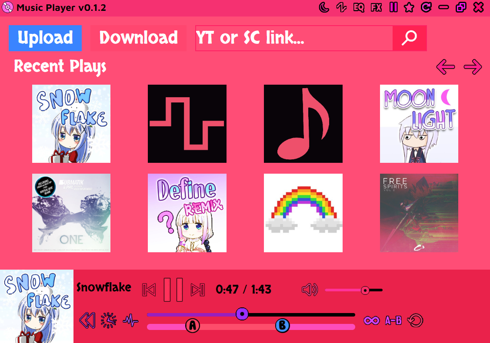

## Music Player

This is a music player that can apply cool effects such as reversing, time stretching, and pitch shifting in real-time.
It's basically the GUI version of my [Music Player Web](https://github.com/Tenpi/Music-Player-Web) site.

### Features:
- Play audio (MP3, WAV) and MIDI files
- Adjust the volume of the audio
- Reverse audio in real-time
- Time stretching in real-time (can either preserve or affect the pitch)
- Pitch shifting in real-time (only if time-stretch is set to not affect the pitch)
- Looping from point A to point B
- Support for local files, YouTube videos, and Soundcloud tracks
- Render and download audio/midi with effects
- Keeps a record of recent plays
- Play previous and next tracks (from your file system)
- Customize the controls of the MIDI synthesizer

### Keyboard Shortcuts
- Space: Play/Pause
- Left Arrow: Rewind
- Right Arrow: Fast forward
- Up Arrow: Increase volume
- Down Arrow: Decrease volume
- Mouse Wheel: Increase/decrease volume
- Ctrl O: Upload file
- Ctrl S: Download file

### Installation

Download the latest installer from the [releases](https://github.com/Tenpi/Music-Player/releases) tab. Updates can be installed automatically.

MacOS:
Run the following in terminal after installing to get it to open:
`sudo xattr -r -d com.apple.quarantine "/Applications/Music Player.app"`

### Bugs and Requests

Open an issue on my GitHub repository.

### Also See

- [musicplayer.moe](https://github.com/Tenpi/musicplayer.moe)
- [Photo Viewer](https://github.com/Tenpi/Photo-Viewer)
- [Video Player](https://github.com/Tenpi/Video-Player)
